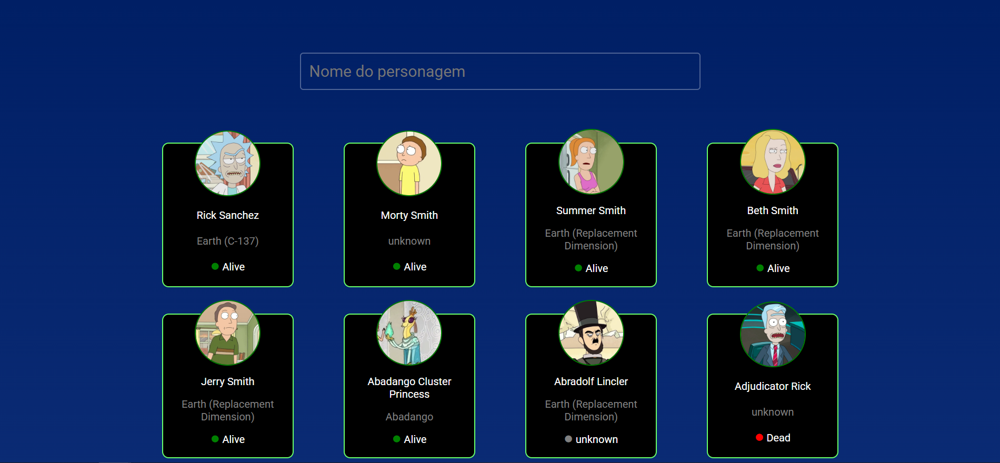

# Consumindo uma API de Rick and Morty
**API Usada**: https://rickandmortyapi.com/

**Link do Site**: https://rick-and-morty-api-virid-nu.vercel.app/

O objetivo desse projeto é consumir uma API e manipular os dados na DOM, mostrando as informações iniciais como:

* **Nome**
* **Local de Origem**
* **Status**:

Também é possível pesquisar um nome de personagem na barra de pesquisa, para ver as informações completas.

## Passos Concluidos

:white_check_mark: Design Inicial da primeira página.  
:white_check_mark: Consumir a API.  
:white_check_mark: Fazer o circulo de status mudar de cor.  
:white_large_square: Fazer a barra de pesquisa funcionar.  
:white_large_square: Criar página de descrição do personagem.  

## Esquema das páginas

**Página Inicial :**
