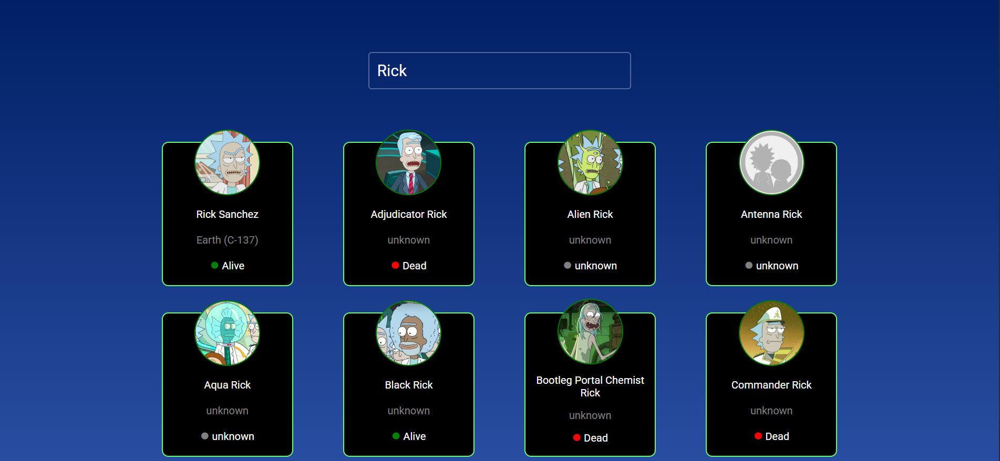
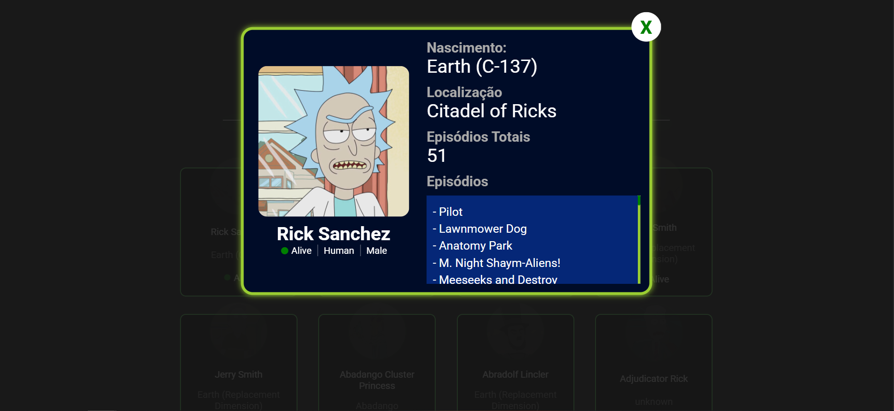
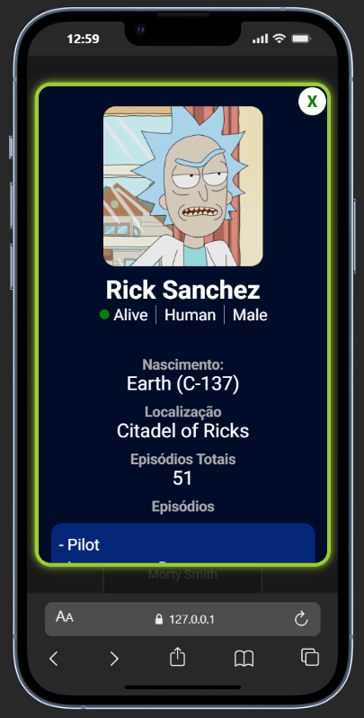

# Consumindo uma API de Rick and Morty
**API Usada**: https://rickandmortyapi.com/

**Link do Site**: https://rick-and-morty-api-virid-nu.vercel.app/

O objetivo desse projeto é praticar e consumir uma API para manipular os dados na DOM, mostrando as informações iniciais como:

* **Nome**
* **Local de Origem**
* **Status**

Também é possivel ver mais informações selecionando o personagem, abrirá um modal com outras informações do personagem como:
* **Lugar de Origem**
* **Localização Atual**
* **Quantidade de episódios que o personagem participa**
* **Lista dos episódios que o personagem participa**

Também é possível pesquisar um nome de personagem na barra de pesquisa, vai retornar todo personagem que tiver o nome digitado.

## Passos Concluidos

:white_check_mark: Design Inicial da primeira página.  
:white_check_mark: Consumir a API.  
:white_check_mark: Fazer o circulo de status mudar de cor.  
:white_check_mark: Fazer a barra de pesquisa funcionar.  
:white_check_mark: Criar página de descrição do personagem.  
:white_check_mark: Fazer os Media Queries. 

## Esquema das páginas

**Página Inicial :**
 
**Quando realizar a pesquisa**, digitando o nome do personagem e apertando ENTER, vai retornar todos os cards que tem esse nome.
 
**Página de descrição do personagem**.
 
**Modal responsivo para dispositivos móveis**
 
**Quantidade de páginas do resultado**, cada página tem 20 cards.
 

